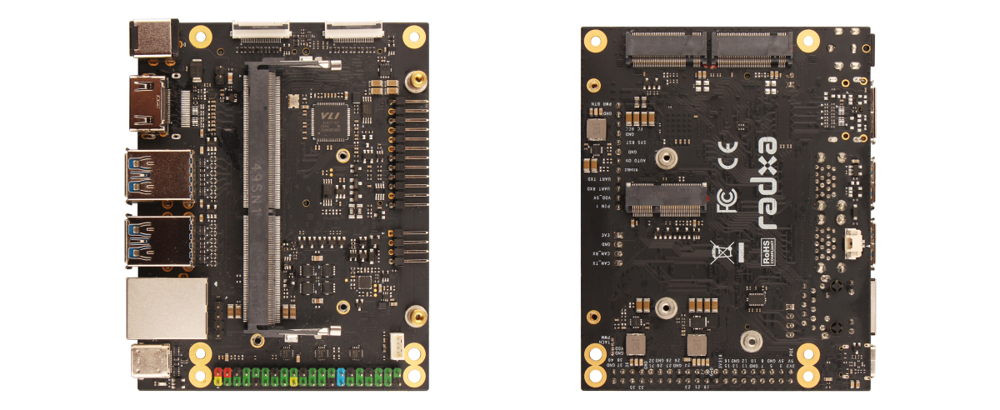
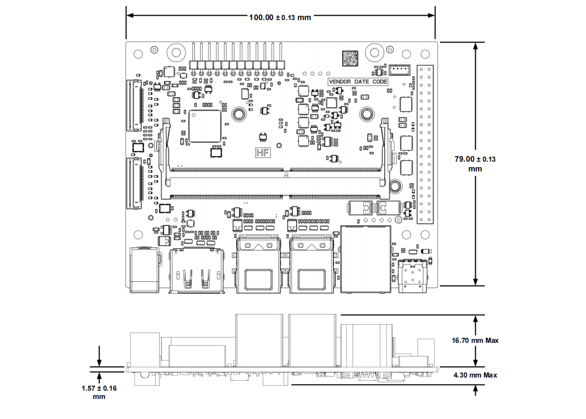

# Radxa NX4 IO Board

## Introduction

Radxa NX4 IO Board is a highly expandable carrier board designed specifically for Radxa NX4. Targeting edge computing, industrial control, computer vision development, and rapid prototyping, it provides essential interfaces for display, cameras, high-speed USB, networking, and storage expansion — helping developers quickly complete evaluation, prototype bring-up, and system integration, and accelerating the path from development to deployment.

Key Features:

- HDMI display output
- Dual MIPI CSI interfaces
- High-speed peripheral connectivity: 4x USB 3.2 Type-A + 1x USB 3.2 Type-C
- M.2 M Key 2280 expansion slot
- Gigabit Ethernet with PoE support (additional PoE module required)
- 40-pin GPIO header and 12-pin button header for easy peripheral expansion and debugging control
- System support interfaces including fan header, RTC battery connector, and CAN bus
- DC5525 power input (9–20V)

## Interfaces

- 1x HDMI interface
- 2x MIPI CSI interface
- 4x USB 3.2 Type-A Port
- 1x USB 3.2 Type-C Port
- 1x M.2 M Key 2280 Slot
- 1x Gigabit Ethernet with PoE Support (Addition PoE Module Required)
- 1x 40-Pin GPIO Header
  - Support I2C, SPI, UART, GPIO, etc.
- 1x 12-Pin Button Header
  - Support Power, Reset, etc.
- 1x Fan Header
- 1x CAN Bus Header
- 1x RTC Battery Header
- 1x PoE Backpower Header
- 1x PoE Header
- 1x 260-Pin SO-DIMM Connector
- 1x DC5525 Power Header (Voltage range: 9-20V)

Note: The M.2 M Key 2230 Slot and M.2 E Key 2230 Slot are not supported by the Radxa NX4 IO Board.

## Mechanical Specification

{width=100%}

## Availability

Radxa guarantees availability of the Radxa NX4 IO Board until at least December 2035.

Note: Component shortages or third-party supplier discontinuations may affect actual delivery times.

## Support

For support please see the hardware documentation section of the [Radxa Document](https://docs.radxa.com/) website and post questions to the [Radxa forum](https://forum.radxa.com/).